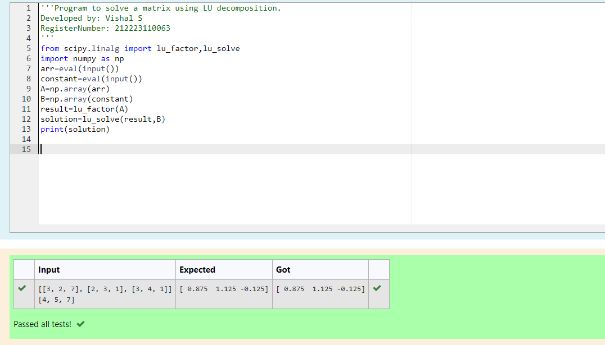

# LU Decomposition 

## AIM:
To write a program to find the LU Decomposition of a matrix.

## Equipments Required:
1. Hardware – PCs
2. Anaconda – Python 3.7 Installation / Moodle-Code Runner

## Algorithm
(i)
1. In first step imports the required libraries: NumPy for numerical operations and 'lu' function from SciPy's linear algebra module for LU decomposition.
2. In second step the line prompts the user to enter a matrix. The 'eval' function is used to evaluate the input as a Python expression, and 'np.array' converts it into a NumPy array.
3.  In third step the 'lu' function is used to perform LU decomposition on the input matrix 'A'. It returns three matrices: 'P' (permutation matrix), 'L' (lower triangular matrix), and 'U' (upper triangular matrix).
4.  In fourth step the line prints the lower triangular matrix 'L' obtained from the LU decomposition.

5. In fifth step the line prints the upper triangular matrix 'U' obtained from the LU decomposition.

6. End program. 

(ii)
1. In first step imports the required libraries: NumPy for numerical operations and lu_factor, lu_solve functions from SciPy's linear algebra module.

2. In second step the line defines a 3x3 matrix A and a 1D array b.

3. In third step the lu_factor function is used to perform LU factorization on the matrix A. It returns the factors lu and piv (pivot indices).

4. In fourth step the lu_solve function is used to solve the system of linear equations using the LU factorization. It takes the LU factorization lu, pivot indices piv, and the right-hand side vector b as inputs and returns the solution.

5. In fifth step the line prints the solution obtained by solving the system of linear equations.

6. End program.

## Program:
(i) To find the L and U matrix
```
/*
'''Program to find L and U matrix using LU decomposition.
Developed by: Vishal S 
RegisterNumber: 212223110063
'''

from scipy.linalg import lu
import numpy as np
arr=eval(input())
A=np.array(arr)
P,L,U=lu(A)
print(L)
print(U)
*/
```
(ii) To find the LU Decomposition of a matrix
```
/*
'''Program to solve a matrix using LU decomposition.
Developed by: Vishal S 
RegisterNumber: 212223110063
'''
from scipy.linalg import lu_factor,lu_solve
import numpy as np
arr=eval(input())
constant=eval(input())
A=np.array(arr)
B=np.array(constant)
result=lu_factor(A)
solution=lu_solve(result,B)
print(solution)


*/
```

## Output:
(i)

(ii)


## Result:
Thus the program to find the LU Decomposition of a matrix is written and verified using python programming.

